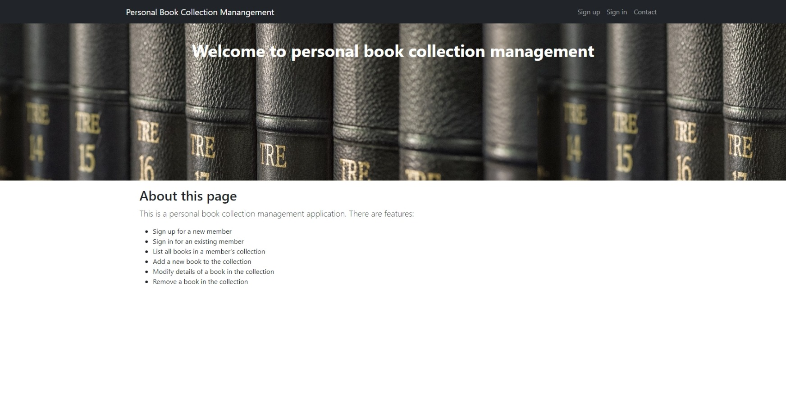
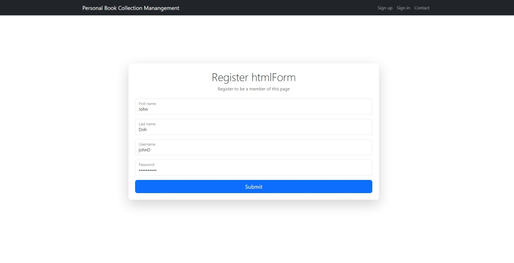
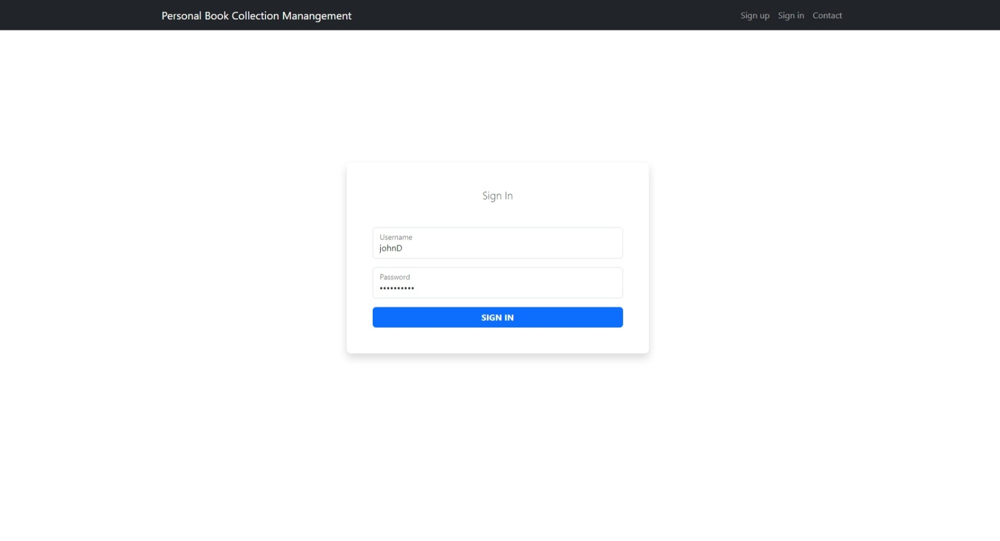
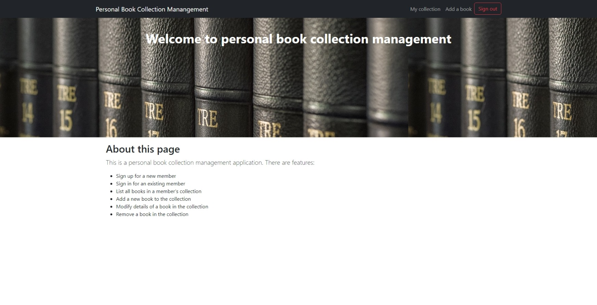
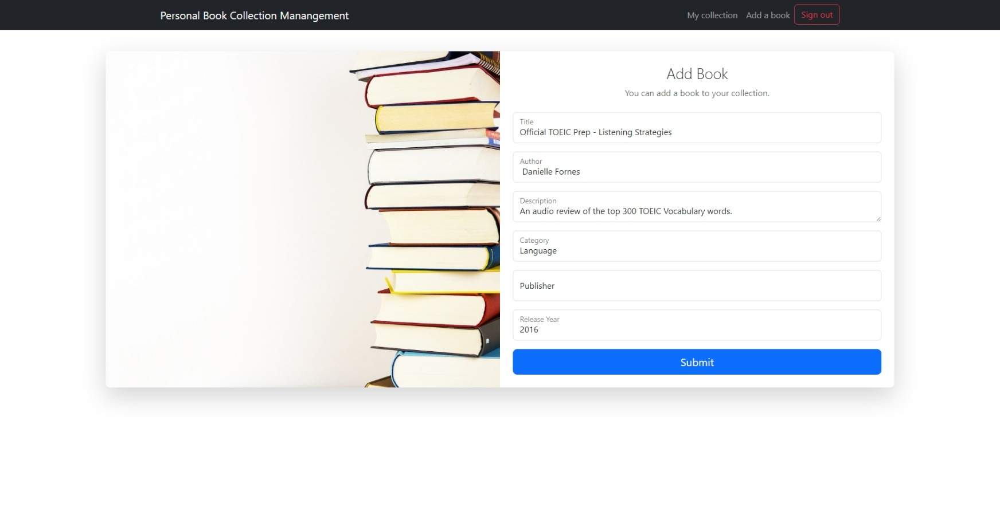
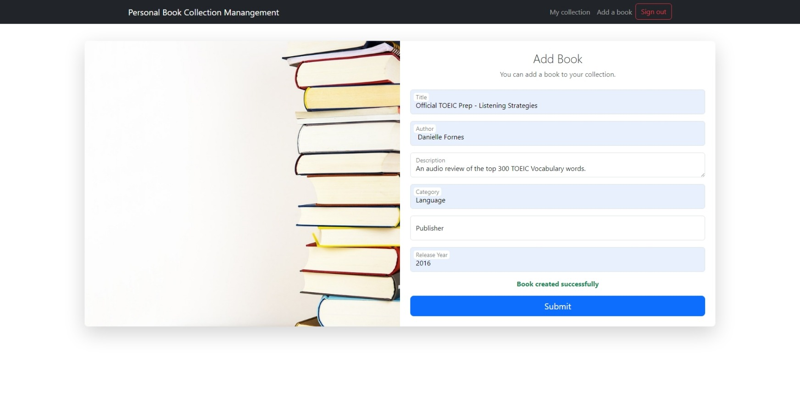
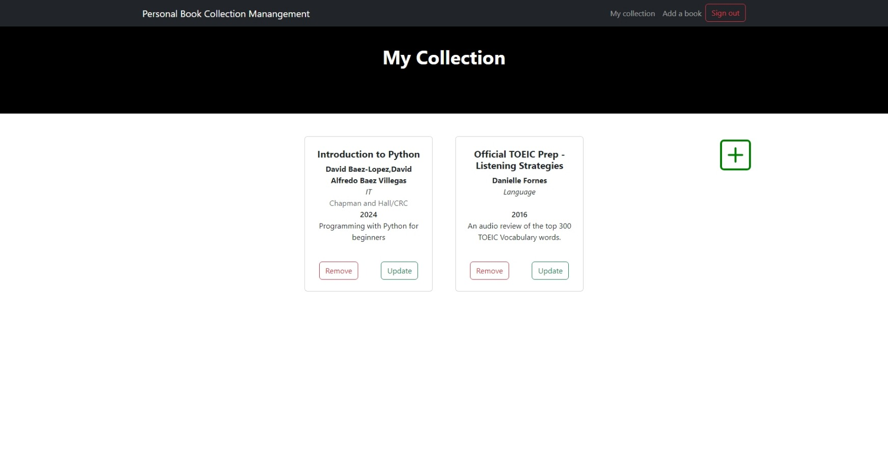
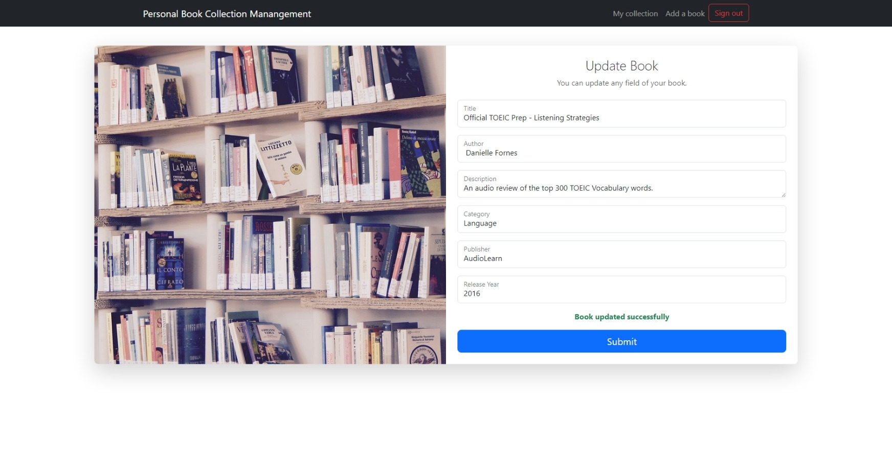
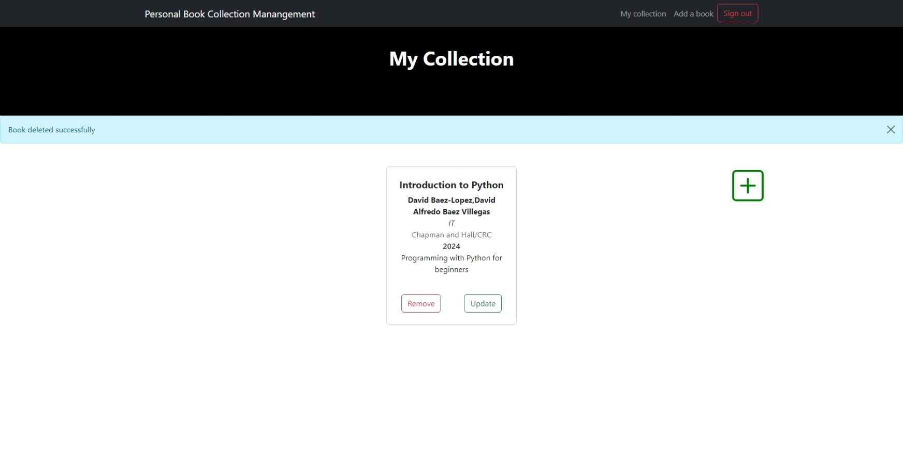

# Book Collection Manangement 
### Project for Back-en Partime bootcamp of Tech UP Thailand
## Project Requirements : Server (Back-end)
1. #### Backend (Express)
   - Create RESTful API has features :
      - Register, Login, Logout by JWT Authentication
      - CRUD API for book collection management
   - Validate and handle errors of each API
   - Create Middleware for Authentication of API
2. #### Database
   - PostgreSQL (local)
3. #### Other Requirements
   - Use Express to create API
   - Git for version control
   - API Document Swagger : localhost:4000/api-docs
4. #### Frontend (React) - Optional
   - Create User Interface
      - Registration
      - Sign in
      - List a book collection
      - Add a new book
      - Update an existing book
      - Remove an existing book.
   - State management (Context API)
   - Form validation
   - Responsive design

5. #### Examples of UI
      
      
      
      
      
      
      
      
      

